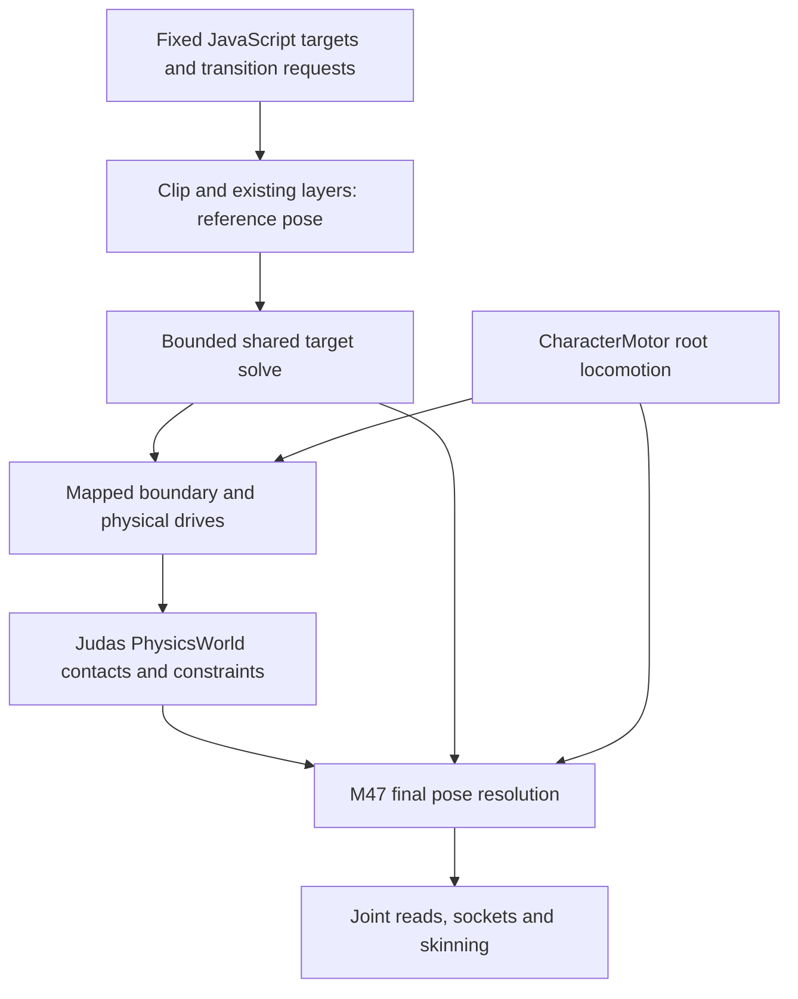

# M70 — multi-target IK and partial physical animation

**Candidate, uncommitted.** Accepted base: `934c5d3f0556c920cc7cae8b80dc4677d8cbf87b`.
Judas solves poses and drives physical joints. Projects choose contacts, actions,
impacts and recovery. Claude's later adoption is separate consumer evidence.
The operator accepted the other lab behaviours; human re-test of the passive-mode
performance correction remains pending.

## Ownership and actual fixed-step phases

The accepted baseline samples animation after physics. M70 adds a pre-physics
reference preparation only for instances using the new capabilities; it does
not advance playback twice or reorder the disabled legacy path.

| Phase | Owner and sample | Writes / authoritative result |
|---|---|---|
| `FixedScripts` | Project JS; prior completed authoritative joint/physics sample | Atomic mappings/target sets and physical-mode requests are submitted for the upcoming fixed boundary. A read here cannot see future physics. |
| Opted-in CharacterMotor update | CharacterMotor; desired velocity and actual support from normal authoritative geometry | For M70 instances, root locomotion completes before reference/world-target conversion and anchor preparation. Full physical handoff explicitly disables the motor. |
| M70 reference preparation | RuntimeWorld; current clip time advanced once, existing crossfade/layers and legacy limb IK, then shared target solve | One immutable-for-this-step reference pose. World targets use the authoritative entity/support sample, never a camera's interpolated matrix. Pelvis correction changes skeletal locals only. |
| Boundary and drives | Existing ragdoll/body/joint mapping; this reference pose | Validate requested authority transition before publishing it. Prescribed unselected anchors and bounded dynamic joint drives use explicit bone/body/COM frames. |
| `PhysicsWorld::Step` | Judas contacts, constraints, gravity and inertia | Dynamic mapped bodies receive the single authoritative physical result; target poses do not overwrite it. |
| Existing post-physics motor / body synchronization | Non-M70 CharacterMotor instances and ordinary rigid body ownership | The disabled legacy path keeps its accepted ordering. An opted-in motor is not moved twice. |
| Physical pose resolution | RuntimeWorld; current physical bodies plus prepared reference | Convert mapped bodies back into hierarchical locals, compose through M47 once. IK is not reapplied after physics over owned joints. |
| Joint reads, sockets, skinning and presentation | Same final resolved pose; entity presentation interpolation for the requested sample | Sockets and GPU palettes consume the same final pose. Presentation/camera rate never drives physics. |

### Compatibility guarantees

- No M70 configuration: accepted layer, crossfade, limb-IK, socket, root-motion
  and ragdoll semantics retain the original path.
- Immutable imported skeletons/clips/mesh bindings remain shared. Each instance
  owns its targets, reference, solve status and physical articulation.
- CharacterMotor, skeleton posing and articulated physics remain distinct.
- A skeletal pelvis correction never moves the entity/capsule/root-motion track.
- Uninvolved helper/finger/head-hidden branches are preserved; no universal up
  direction or anatomical names are inferred by the engine.

## Public API boundary

New batched configuration uses ordinary JSON tuples `[x,y,z]` and `[x,y,z,w]`.
Existing individual JudasJS vector methods retain `{x,y,z}` / `{x,y,z,w}`.

| API | Purpose |
|---|---|
| `entity.animation.configureIK(settings \| null)` | Atomically configure/clear explicit skeleton root/spine/chains/limits and target set. |
| `entity.animation.ikTargets(targets)` | Replace the bounded target set atomically. |
| `entity.animation.ikStatus` | Copied readiness, diagnostic and per-effector solve result. |
| `entity.ragdoll.configurePhysical(settings \| null)` | Atomically configure/clear physical region/drive settings. |
| `entity.ragdoll.setMode(mode, options)` | Request animation/partial/active/passive authority at a safe fixed boundary. |
| `entity.ragdoll.physicalState` | Copied mode, pending state, diagnostics, drive errors and saturation. |

Exact settings, caps, units, refusal/lifetime rules and executed examples are
documented in [the animation/ragdoll reference](judasjs/animation-ragdolls.md).
The lab consumes these public APIs, M49 motor motion, M67 named authoring/import,
M41 UI, M61 saves and M38 packaging.

## Incremental adoption in an existing game

1. Keep the existing motor, clips, crossfades, Carry/head-hidden layers and socket
   attachments. Read `animation.info.joints` after `ready`, and author explicit
   keys/contact frames using the normal skeleton picker. Names in the lab are
   fixture data; do not copy them onto another rig.
2. Add shared IK alone first. `configureIK` declares the body-root/spine/chains
   and limits; `ikTargets` submits one complete set of desired palm/sole frames
   during `fixedUpdate`. Use authoritative support/entity transforms. Remove a
   support's targets if its safe handle is no longer valid. No ragdoll is needed.
3. Inspect each residual and `rootCorrection`, rather than relocating the whole
   character to force contacts. A fixed callback reads the previous completed
   result; newly submitted targets resolve at the upcoming reference boundary.
   Presentation joint/socket reads use the displayed sample only for visuals.
4. Add an ordinary explicit body/constraint mapping and one selected physical
   region. Keep the visual hidden head/helper branches intact; an unmapped visual
   joint needs no rigid body. `configurePhysical` plus `setMode('partial')` keeps
   the motor's root authority while actual dynamic joints respond to impulses.
5. Use `ragdoll.body(key)` and ordinary impulses for impacts. Set `effortWeight`
   to zero as the passive-effort control: physical motion still supplies the
   pose. `poseWeight` is a separate visual blend, not a way to disable physics.
6. Explicitly hand off the motor for full `active`/`passive` modes. Passive release
   preserves current physical motion. Return with a game-chosen, collision-valid
   placement and fade; handle refusal without overwriting physical state. No
   automatic recovery/get-up behaviour is provided.

The copyable [multi-target example](judasjs/examples/multi-target-ik.js) and
[physical-region example](judasjs/examples/physical-animation.js) run on the
approved lab fixture through the real VM. Adapt their mappings and target policy,
not their joint names, to a consumer game. Claude's adoption remains separate
evidence; this milestone does not modify his project or remove his workarounds.

### Source overlap when integrating separate consumer fixes

No pending consumer change was merged or cherry-picked for this candidate. The
accepted baseline already exposes `clearSocket()`; the lab uses normal authored
sockets and does not depend on a proposed `setSocket(null)` behaviour. Existing
clip import/trim remains in `ModelCook.cpp`, which M70 does not change. A reported
local consumer fix is not assumed to be upstream solely because it was described.

| Shared source area | Preserve when reviewing a separate change |
|---|---|
| `src/ScriptSystem.cpp` | Existing facade/native behaviour plus atomic IK/physical bindings and articulated event attribution. Review the affected conditions; do not choose an entire file version. |
| `src/WorldAnimation.cpp` | Existing clip/layer/rootMotion/socket semantics and the fixed reference/final boundary. Frame-side edits must not publish pending target batches early. |
| `src/SceneSerialization.cpp`, `src/Scene.h`, `src/SceneFingerprint.cpp` | Optional ordinary IK/physical settings, legacy default compatibility and canonical identity rules. |
| `src/RuntimeWorld.h`, `src/FullBodyIK.h`, `src/PhysicalAnimation.h`, `src/Ragdoll.h` | Shared immutable asset ownership, per-instance/disposable caches and explicit pose/physics authority. No duplicate skeleton or persistent raw pointer state. |
| `src/editor/ComponentEditors.cpp` | Existing component/picker/undo workflow beside the small mapping/region controls. |

This describes verified M70 overlap boundaries, not the contents or mergeability
of any unavailable consumer patch. Adopt each independently reviewed correction
without dropping either the accepted baseline or the M70 boundary contracts.

## Integration fixture and provenance

`projects/character_lab/character_lab.judasproj` is an ordinary project with wall,
board and physical scenes. `scripts/create_m70_lab.py` emits original glTF source
art, then invokes the shipped named authoring/import/fit services. It does not
write private positional scene records or solve IK/physics in project code.

The original CC0 equivalent has **65 source joints**, helper/finger branches,
six independently bound mesh parts and two differently ordered skin palettes.
Its 71 source hierarchy nodes are retained beside the normal importer-added
motion root, giving 72 normalized runtime nodes and 130 draw-palette entries.
The second fixture has different names/proportions and an explicit mapping.
Idle, Carry, Wave and HeadHidden clips exercise existing clip/layer behaviour.
No restricted original Skate/M66 art or cooked derivative is redistributed;
the existing local provenance rules remain intact.

## Deliberate limits

- Shared IK is a bounded simultaneous damped solve, not a reachability guarantee.
  Impossible or mutually conflicting requests return a finite pose and explicit
  per-target residual/status. Limits are 12 targets, 64 participating joints and
  at most 96 iterations; the lab uses the ordinary 64-iteration setting.
- Positive uniform model scale is supported. Reflected, sheared or singular
  participating paths are rejected. Uninvolved hidden branches remain valid.
- Physical regions use the existing authored body/constraint mapping. Dynamic
  regions respond to gravity, contacts, inertia and capped relative torques;
  their bodies can lag or saturate instead of matching animation exactly.
- There is no balance, foot-placement policy, contact selection, automatic
  standing/recovery, or fixed-root full-body drive. Those meanings remain outside
  this milestone. The lab chooses targets and explicit return placement in JS.
- A live articulation cannot silently stream out as ordinary animation.
  Durable configuration/authority survives supported save restoration, while
  sampled target status and drive-motion history start fresh.

## Evidence status

The preceding candidate's Linux/GCC 15.2.0 Release build had zero warnings.
Focused shared IK
38/38, physical animation 64/64, full-rig real-VM lab 66/66, separate-process save
writer 10/10 and reader 14/14, types/live API and affected legacy checks passed.
Editor duplication/undo and Play/Stop retained identical authored content. The
moved package loaded all three scenes from an unrelated working directory.

Preceding-candidate same-binary 1/10-instance M56 measurements cover disabled,
IK, partial and passive modes. Ten partial instances cost 1.743 ms median /
2.778 ms p95 fixed; ten passive full articulations were contact-heavy at
15.417 / 38.952 ms, with a
75.039 ms maximum. These retained measurements precede the human-reproduced
passive performance failure and its correction; they are not current corrected
passive timings. The [passive follow-up](evidence/m70/development/passive-follow-up/REPORT.md)
records the actual two-rig project's measured cause and preceding geometry-work
correction. The later landing-freeze correction below supersedes that handback.
The earlier stripped passive-from-rest
benchmark was not an equivalent workload. No desktop FPS or crowd-rate promise
is inferred from either CPU measurement.

Results, preserved failures, exact commands and candidate fingerprints are in
[the evidence report](evidence/m70/REPORT.md). Other lab behaviours have operator
acceptance; the refreshed passive scene still requires human re-test. Windows
and Claude's actual adoption remain unvalidated. Offscreen pointer-capture
warnings are reported separately from that human review. Candidate remains
uncommitted; final M70 acceptance is not claimed.

## Current consumer and landing-freeze follow-up

The subsequent human G/floor freeze rejected the preceding passive performance
handback. The [consumer and numerical landing follow-up](evidence/m70/development/passive-crash-follow-up/REPORT.md) records
the exact core reproduction, rotation-sampling correction, explicit owner-contact
subscription, API conventions and affected results. Windows M70 moved-package
validation remains outstanding. The corrected landing candidate requires human
re-test; prior successful measurements retain their preceding-candidate scope.

The identical captured CCD state now completes in 29.343 ms (compact recipe
re-check: 29.937 ms), rather than timing out beyond 35 seconds. Unrepresentable
angular updates preserve the quaternion anchor instead of normalizing it into
false repeated contact changes; actual represented rotation retains the original
math. Segment lookup is logarithmic with the original boundary selection.
No contact filtering, cadence, solver budget or quality reduction hides the fix.

`entity.ragdoll.receiveContactEvents` is a default-false, authored/runtime opt-in
for owner-script M42 delivery from unscripted mapped bones against unscripted
external colliders. Same-owner articulation pairs are omitted from forwarding;
safe body/joint attribution and ordinary pair/phase deduplication remain.
The actual bone/ground, lifetime, filter and callback-destruction checks pass.
Configuration tuples versus live object vectors are explicitly documented;
legacy limb IK remains distinct from shared IK orientation targets.

Current two-rig passive fixed-step median/p95/max is 1.317/8.643/34.539 ms,
settling after two seconds to 1.245/3.682/5.213 ms. Full active wall contact work
remains costly at 16.120/39.001/65.979 ms; passive-to-active reaches 69.272 ms.
These are CPU measurements, not a desktop FPS guarantee. All four 600-step
fixtures, affected motion/contact/physical/API checks, editor Play/Stop and
moved-package landing/lifetime smokes complete successfully. Windows M70
moved-package validation and corrected human landing acceptance remain pending.
